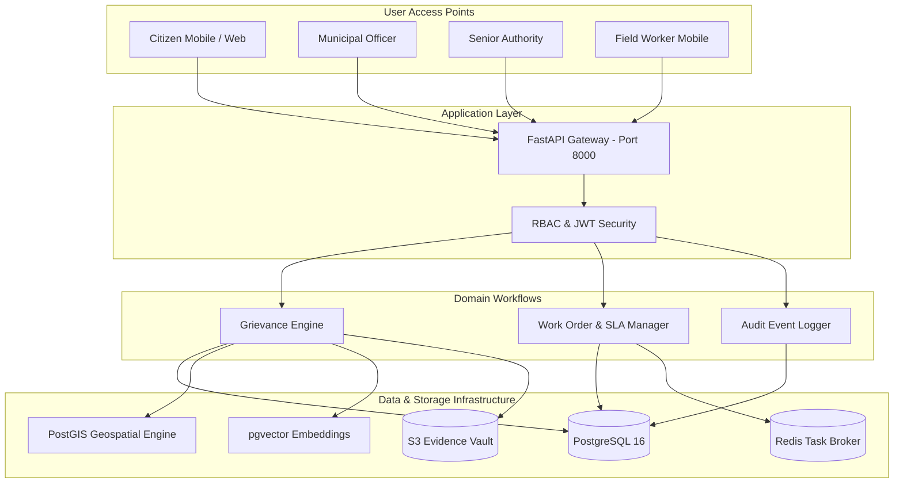

# GrievanceGrid

### Evidence-Aware Civic Complaint and Resolution Platform

[](https://www.python.org/)
[](https://fastapi.tiangolo.com/)
[](https://reactnative.dev/)
[](https://expo.dev/)
[](https://www.postgresql.org/)
[](https://www.docker.com/)

> **Academic Context & Disclaimer**  
> GrievanceGrid is an academic research prototype developed as part of the B.Tech in Computer Science and Engineering programme at the **Indian Institute of Information Technology, Kottayam (IIIT Kottayam)**.  
> It is an experimental system designed to investigate evidence-aware civic grievance understanding, multi-issue decomposition, work-order dispatching, and issue-level resolution auditing. It is **not** an official government portal, does not claim official government endorsement, and is not an official CPGRAMS deployment.

---

## 1. Problem Statement

Municipal grievance redressal platforms encounter several fundamental challenges that degrade citizen satisfaction and administrative accountability:

1. **Compound Grievances**: A single citizen complaint often contains multiple distinct municipal problems (e.g., an overflowing sewer that caused an asphalt crater and exposed electrical wiring). Monolithic ticket systems assign the report to a single department, leaving secondary hazards unaddressed.
2. **Unstructured Narrative Text**: Citizen reports vary significantly in phrasing, detail, and emotional tone, complicating triage and urgency scoring.
3. **Incomplete or Inconsistent Evidence**: Submissions often feature blurry photographs, misattributed damage, or conflicting location descriptions.
4. **Redundant & Related Reports**: The same infrastructure failure is frequently reported by multiple neighbors, producing duplicate work orders and scattered tracking.
5. **Superficial Work-Order Completion**: A field technician closing a work order on-site is not definitive proof that all constituent issues have been fully remedied.
6. **Lack of Human Oversight**: Automated rules without transparent, verifiable human-in-the-loop decision points risk misrouting critical emergencies.

---

## 2. Research Focus & Question

### Research Question
> *"How can AI assist in understanding, connecting, and evaluating civic grievances by analysing individual issues, multimodal evidence, related reports, and resolution responses?"*

### Research Focus
> *"Using AI to transform unstructured civic complaints and supporting evidence into actionable, traceable, and reviewable information for better grievance resolution."*

---

## 3. Core Workflow

```
[ Citizen Grievance Submission ]
               │
               ▼
   [ Text & Multi-Issue Parser ] ───► Breaks complaint into discrete issue contracts
               │
               ▼
     [ Multimodal Evidence ]     ───► Cryptographic SHA-256 digest + metadata check
               │
               ▼
   [ Semantic & Spatial Link ]   ───► Incident clustering across neighborhood dockets
               │
               ▼
  [ Municipal Officer Review ]   ───► Human confirmation & jurisdictional routing
               │
               ▼
  [ Departmental Work Orders ]   ───► Dispatched to specialized field technicians
               │
               ▼
    [ Response Evidence Vault ]  ───► On-ground remediation photos & field telemetry
               │
               ▼
   [ Issue Resolution Audit ]    ───► Verifies remediation against each issue contract
               │
               ▼
 [ Authoritative Officer Sign-off ]──► Official closure or escalation
               │
               ▼
  [ Feedback & Recurrence Watch ]──► Citizen feedback loop + spatial recurrence audit
```

### Collaborative Actor Model
- **AI Modules**: Provide assistive categorization, candidate duplicate linking, and response coverage signals.
- **Municipal Officer**: Holds authoritative responsibility for review, assignment, verification, and closure.
- **Field Worker**: Executes physical remediation orders and submits on-ground photographic evidence.
- **Senior Authority**: Monitors administrative SLA compliance, escalation alerts, and cross-department trends.

---

## 4. Key Research Contributions

1. **Evidence-Provenance Incident Graph**: A spatial-semantic graph connecting citizen complaints, decomposed issue nodes, cryptographic evidence hashes, and departmental jurisdictions for duplicate detection and cluster remediation.
2. **Cross-Modal Evidence Conflict & Uncertainty Detection**: Automated cross-referencing between citizen narrative text and uploaded imagery to detect discrepancies and uncertainty flags for officer attention.
3. **Issue-Specific Resolution Contract & Response Audit**: Enforces that a grievance is not resolved until each decomposed issue has verified evidentiary coverage from assigned field units.
4. **Post-Resolution Recurrence Analysis**: Monitors spatial and temporal recurrence patterns post-resolution to identify chronic municipal failures and assess contractor work durability.

---

## 5. Technology Stack & Implementation Status

| Component | Technology | Implementation Status |
| :--- | :--- | :--- |
| **Mobile Application** | React Native, Expo (SDK 57), Hermes, Fabric | **Implemented & Verified on Device** |
| **Web Portal** | Next.js / Vite, TypeScript | **Implemented** |
| **Backend REST API** | FastAPI, Uvicorn, Pydantic, Python 3.11+ | **Implemented** |
| **Relational Database** | PostgreSQL 16 | **Implemented** |
| **Spatial Extensions** | PostGIS 3.4.3 (SRID 4326) | **Implemented** |
| **Vector Storage** | pgvector 0.8.6 | **Implemented** |
| **Containerization** | Docker, Docker Compose | **Implemented** |
| **Background Processing**| Redis 7, Celery | **Configured / Prototype** |
| **Evidence Storage** | S3-Compatible Object Store | **Configured / Local Storage Active** |
| **Issue Parsing / NLP** | IndicBERTv2, Multilingual-MiniLM | **Planned (Phase 2)** |
| **Visual Classification**| EfficientNet-B0 | **Planned (Phase 2)** |
| **Incident Link Scoring**| Spatial Buffer + Logistic Regression | **Prototype Evaluated** |

---

## 6. System Features

### Citizen Experience (Mobile & Web)
- Unified credential-based sign in with session persistence and secure logout.
- Step-by-step grievance submission: Category, Narrative Description, Location capture, Photo attachment.
- Automatic docket generation (`GG-YYYY-XXXXXX`) with real-time status tracking.
- Interactive timeline tracking transitions across `SUBMITTED`, `ASSIGNED`, `IN_PROGRESS`, `AWAITING_VERIFICATION`, and `RESOLVED`.
- Citizen feedback submission (1-5 star rating) and formal appeals for incomplete resolutions.

### Municipal Officer Operational Portal
- Real-time departmental docket review filtered by status (`Pending Review`, `In Progress`, `Resolved`).
- Single-tap field team dispatch with priority assignment.
- Authoritative resolution execution with administrative audit logging.

### Field Worker Mobile Dispatch
- Dedicated mobile view for assigned on-ground work orders.
- Status transition logging (`ASSIGNED` $\to$ `IN_PROGRESS` $\to$ `COMPLETED`).
- On-site evidence and completion remarks submission.

### Senior Authority Oversight Dashboard
- Executive KPI overview: Total complaints filed, resolution rate %, cases under action, and priority alerts.
- Departmental category volume distribution breakdown.

---

## 7. Authentication & Role-Based Access Model

GrievanceGrid uses a **single unified sign-in screen**. Users do not select a role manually on the client. Credentials submitted to `/api/auth/login` are verified server-side, and the backend issues a signed JWT containing the user's authoritative role.

```
                    [ User Enters Credentials ]
                                │
                                ▼
                       POST /api/auth/login
                                │
                    ┌───────────┴───────────┐
                    ▼                       ▼
            [ Valid Account ]      [ Invalid Credentials ]
                    │                       │
                    ▼                       ▼
          Returns: JWT + Role       HTTP 401 Unauthorized
                    │
    ┌───────────────┼───────────────┬───────────────┐
    ▼               ▼               ▼               ▼
[ CITIZEN ]  [ OFFICER ]     [ AUTHORITY ]   [ FIELD_WORKER ]
    │               │               │               │
    ▼               ▼               ▼               ▼
Citizen Home  Officer Portal  Authority Dash  Worker Dispatch
```

### Demonstration Development Accounts

| Account Type | Email Address | Default Dev Password | Primary Experience |
| :--- | :--- | :--- | :--- |
| **Citizen** | `citizen@grievancegrid.gov.in` | `Password123!` | Citizen Home & Report Flow |
| **Municipal Officer** | `officer@grievancegrid.gov.in` | `Password123!` | Operational Review Portal |
| **Senior Authority** | `authority@grievancegrid.gov.in` | `Password123!` | Performance Monitoring Dashboard |
| **Field Worker** | `worker@grievancegrid.gov.in` | `Password123!` | Work Order Remediation |

*Note: These credentials are demonstration fixtures for local research evaluation. Production deployments require secure password rotation and environment-configured secrets.*

---

## 8. Responsible AI Design Principles

1. **Assistive, Not Autonomous**: AI models generate recommendations (e.g., suggested category, candidate duplicate); authorized human officials retain decision authority.
2. **Probabilistic Transparency**: Classification and similarity scores represent confidence thresholds, not factual certainty.
3. **No Automated Citizen Penalization**: Discrepancies between narrative text and photographic evidence trigger human review rather than automatic dismissal.
4. **Immutable Audit Ledger**: Every recommendation, officer action, and field worker update is permanently logged in `audit_events` with actor ID, timestamp, and network IP.
5. **Configured Governance Rules**: Municipal SLA targets, escalation thresholds, and routing hierarchies are explicit policy configurations, not black-box model outputs.

---

## 9. Datasets & Evaluation Framework

### Datasets
- **NYC 311 Service Requests** (Open Public Data): Benchmark for complaint taxonomy and dispatch SLA distribution.
- **RDD2022 (Road Damage Dataset)**: Benchmark for road infrastructure defect classification.
- **TACO (Trash Annotations in Context)**: Benchmark for municipal sanitation and solid waste analysis.
- **Human-Annotated Grievance Benchmark**: Synthetic and permissioned multi-issue complaints with ground-truth issue spans.

### Intended Evaluation Metrics
- **Category Classification**: Precision, Recall, Macro-F1.
- **Issue Decomposition**: Precision, Recall, Exact-Span F1, Missed Issue Rate.
- **Incident Linking**: Precision, Recall, False-Link Rate.
- **Response Coverage Audit**: Precision, Recall, F1, False "Addressed" Rate.

> *Experimental results will be reported after the controlled evaluation phase.*

---

## 10. System Architecture Diagram



---

## 11. Quick Start Guide

### Prerequisites
- Python 3.11+
- Node.js 18+ and npm
- Docker and Docker Compose
- Android SDK / ADB (for native mobile development)

### 1. Database & Services
```bash
# Clone the repository
git clone https://github.com/sivasaiboggu/GrievanceGrid.git
cd GrievanceGrid

# Launch PostgreSQL (with PostGIS & pgvector) and Redis
docker compose up -d db redis

# Verify database container is healthy
docker compose ps
```

### 2. FastAPI Backend
```bash
cd backend
pip install -r requirements.txt

# Run migrations and seed data
python -c "from app.database import Base, engine, SessionLocal; from app.seed import seed_data_if_empty; Base.metadata.create_all(bind=engine); db=SessionLocal(); seed_data_if_empty(db); db.close()"

# Start server
python -m uvicorn app.main:app --host 0.0.0.0 --port 8000 --reload
```
- Health Check: `http://localhost:8000/health`
- OpenAPI Docs: `http://localhost:8000/docs`

### 3. Web Client
```bash
cd ../client
npm install
npm run dev
```

### 4. Mobile Application
```bash
cd ../mobile
npm install

# For physical device testing, provide your local computer Wi-Fi IP
# Example: export EXPO_PUBLIC_API_URL="http://192.168.1.50:8000/api"
npx expo start --dev-client --lan
```

---

## 12. Testing & Verification

```bash
# Backend automated tests (isolated SQLite test environment)
python -m pytest backend/tests -v

# Client web production build verification
cd client && npm run build

# Mobile module integrity verification
node -e "['AuthScreen.js','HomeScreen.js','OfficerPortalScreen.js','AuthorityDashboardScreen.js','FieldWorkerScreen.js'].forEach(s => require('fs').statSync('mobile/src/screens/' + s)); console.log('Mobile screens OK');"
```

---

## 13. Physical Android Device Workflow

1. Ensure the host PC and physical Android phone are on the same Wi-Fi subnet.
2. Enable **USB Debugging** on the Android device and connect via USB.
3. Configure port forwarding:
   ```bash
   adb reverse tcp:8000 tcp:8000
   adb reverse tcp:8082 tcp:8082
   ```
4. Build and install debug APK:
   ```bash
   cd mobile/android && ./gradlew assembleDebug --no-daemon
   adb install -r app/build/outputs/apk/debug/app-debug.apk
   ```
5. Launch the app and confirm backend connection to `/api/health`.

---

## 14. Project Status & Limitations

### Current Status
- **Phase 1 (Completed)**: Core PostgreSQL/PostGIS/pgvector schema, FastAPI endpoints, JWT role routing, citizen mobile/web workflows, officer/authority/worker portal routing, and physical Android device verification.
- **Phase 2 (Upcoming)**: Machine learning integration (multi-issue segmentation, visual defect classification, and automated response audit scoring).

### Known Limitations
- Current deployment is a development research prototype.
- No direct integration with production government CRM/CPGRAMS portals is claimed.
- Evaluation on large-scale municipal benchmarks is pending controlled experimental runs.

---

## 15. Research Roadmap

- [x] **Phase 1: Architecture & Foundation**
  - [x] PostgreSQL + PostGIS + pgvector database schema
  - [x] Unified authentication and server-side RBAC
  - [x] Citizen grievance reporting and timeline tracking
  - [x] Dedicated Officer, Authority, and Field Worker mobile views
  - [x] Physical Android hardware installation and verification
- [ ] **Phase 2: AI & Evidence Intelligence**
  - [ ] Fine-tuning IndicBERTv2 for civic text issue extraction
  - [ ] Vision-language alignment for evidence verification
  - [ ] Incident graph clustering with spatial buffer scoring
  - [ ] Formal response coverage auditing against issue contracts
- [ ] **Phase 3: Longitudinal Evaluation**
  - [ ] Spatial recurrence analysis post-resolution
  - [ ] Multi-municipality policy evaluation

---

## 16. Academic Information

- **Project**: GrievanceGrid
- **Department**: Department of Computer Science and Engineering
- **Institution**: Indian Institute of Information Technology, Kottayam (IIIT Kottayam)

---

## 17. License

This repository is maintained as an academic research prototype. Licensing terms are currently under institutional review by the project team. Consult project contributors prior to commercial distribution or redistribution.
